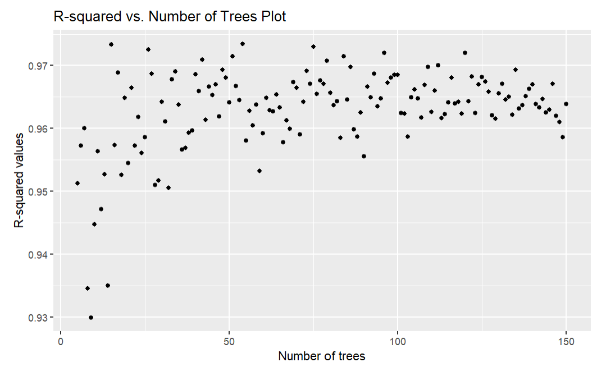
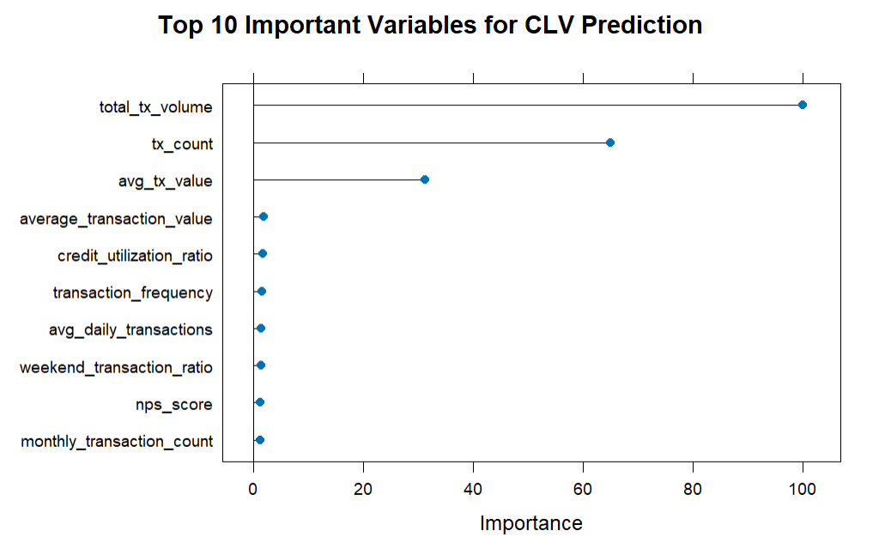
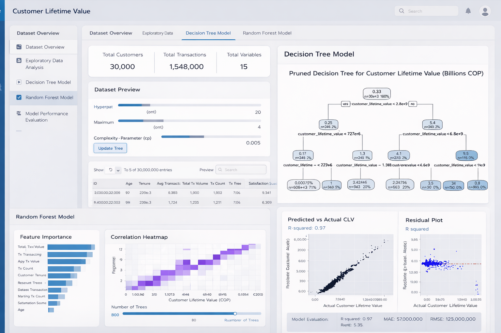

# **Take-home Exercise 2: Prototyping Modules for Visual Analytics Shiny Application**

# 2. Fintech Customer Behavior and Risk Analytics

## 2.1 Overview

Behavioral and trancsactional data from 48723 customers of a Colombian fintech company collected over 12 months from January 4, 2023, to December 29, 2023. Comprises 3,159,157 individual transactions.

## 2.2 Setting the Scene

To analyse temporal patterns in customer financial behavior and engagement using the given COFINFAD Colombian Fintech Financial Analytics Dataset with the aim of identifying the key factors that influence customer lifetime value (CLV) and predicting the long-term financial value generated by customers. In the fintech industry, understanding which customer characteristics and behavioral patterns. The study aims to develop a predictive modelling framework to estimate Customer Lifetime Value (CLV) by identifying the key behavioral and transactional factors that influence long-term customer profitability. To achieve this objective, Regression Tree Regression and Random Forest Regression models are implemented to predict customer lifetime value based on customer financial behavior and engagement indicators, allowing the analysis to both generate accurate predictions and identify the most important drivers of customer value within the fintech platform.

## 2.3 The Task

In this take-home exercise, you are required to select one of the module of your proposed Shiny application and complete the following tasks:

-   To evaluate and determine the necessary R packages needed for your Shiny application are supported in **R CRAN**,

-   To prepare and test the specific R codes can be run and returned the correct visual output as expected,

-   To determine the parameters and outputs that will be exposed on the Shiny applications, and

-   To select the appropriate Shiny UI components for exposing the parameters determine above.

## 2.4 Getting Started

We load the following R packages using the `pacman::p_load()` function:

• **dplyr**: Provides efficient functions for data manipulation such as filtering, selecting, grouping, mutating, and summarising variables.

• **tidyverse**: A collection of essential R packages designed for data science workflows, including data wrangling, transformation, and visualization.

• **janitor**: Helps clean and standardise variable names and datasets, making data easier to work with during analysis.

• **readxl**: Allows importing and reading data directly from Excel files into R.

• **ggstatsplot**: Extends **ggplot2** by integrating statistical tests, effect sizes, and annotations directly into visualisations.

• **ggrepel**: Prevents overlapping text labels in **ggplot2** graphics, improving readability of annotated plots.

• **patchwork**: Enables the creation of composite visualisations by combining multiple **ggplot2** plots into a single layout.

• **colorspace**: Provides tools for creating and manipulating color palettes to improve the visual quality and accessibility of plots.

• **ggdist**: Offers visualization tools for displaying distributions and uncertainty using advanced statistical plots.

• **ggridges**: Allows creation of ridge plots to visualize the distribution of a continuous variable across multiple groups.

• **FunnelPlotR**: Provides functions for generating funnel plots commonly used in performance comparison and statistical analysis.

• **knitr**: Supports dynamic report generation by integrating R code with narrative text in documents such as R Markdown or Quarto.

• **gganimate**: Extends **ggplot2** to create animated graphics that illustrate changes in data over time or across variables.

• **gifski**: Enables the rendering of high-quality GIF animations, commonly used together with **gganimate**.

• **gapminder**: Provides example datasets on global development indicators, often used for data visualization and teaching purposes.

• **ggthemes**: Supplies additional themes, color palettes, and styling options to enhance **ggplot2** visualizations.

• **hrbrthemes**: Provides modern, publication-ready themes for **ggplot2** to improve the aesthetics and readability of plots.

• **rpart**: Implements recursive partitioning algorithms for building decision tree models used in classification and regression tasks.

• **rpart.plot**: Provides enhanced visualization tools for displaying and interpreting **rpart** decision tree models.

• **visNetwork**: Allows the creation of interactive network graphs using the **vis.js** JavaScript library.

• **visTree**: Enables visualization of decision tree structures using interactive network diagrams.

• **htmlwidgets**: Facilitates embedding interactive JavaScript visualizations within R environments such as R Markdown and Shiny.

• **caret**: Provides a unified interface for training, tuning, and evaluating machine learning models.

• **ranger**: Implements a fast and efficient Random Forest algorithm suitable for high-dimensional data.

• **Metrics**: Offers functions for calculating performance metrics such as MSE, RMSE, and MAE for model evaluation.

• **reshape2**: Provides functions for reshaping datasets between wide and long formats to support data analysis and visualization.

• **tidymodels**: A framework for modeling and machine learning that integrates multiple packages for preprocessing, modeling, and evaluation.

• **yardstick**: Supplies tools for calculating model performance metrics such as accuracy, precision, recall, and R².

• **xgboost**: Implements the Extreme Gradient Boosting algorithm, a powerful ensemble machine learning method for predictive modeling.

• **tibble**: Provides a modern and user-friendly version of data frames with improved printing and data handling.

#### Import Package

```{r}
pacman::p_load(dplyr, ggstatsplot, tidyverse,ggrepel, patchwork, janitor,colorspace,ggstatsplot,ggdist,ggridges,FunnelPlotR,knitr,gganimate,gifski,gapminder,ggthemes, hrbrthemes,tidyverse,readxl, rpart, visNetwork, visTree,rpart.plot, htmlwidgets, caret,ranger,patchwork,Metrics, reshape2, tidymodels, yardstick, xgboost,tibble)
```

## 2.5 Load Data

```{r}
customer_data <- read_csv("data/customer_data.csv")
customer_data
```

```{r}
transactions_data <- read_csv("data/transactions_data.csv")
transactions_data
```

## 2.6 Data Pre-processing

### 2.61 Glimpse of data

The customer dataset contains demographic, behavioural, engagement, satisfaction, and financial indicators for fintech users. The glimpse() function is used to inspect the structure of the dataset.

```{r}
glimpse(customer_data)
```

### 2.6.2 Check for duplication

By using the `duplicated()` function,

```{r}
duplicates <- customer_data[duplicated(customer_data), ]
duplicates
```

```{r}
customer_data$customer_id[duplicated(customer_data$customer_id)]
```

### 2.6.3 Filtering data for selected variables

For the Regression Tree analysis, relevant customer-level attributes are selected to build the modelling dataset.

```{r}
df_analysis <- customer_data[, c(
"age",
"household_size",
"credit_utilization_ratio",
"tx_count",
"avg_tx_value",
"total_tx_volume",
"transaction_frequency",
"monthly_transaction_count",
"average_transaction_value",
"weekend_transaction_ratio",
"avg_daily_transactions",
"customer_tenure",
"satisfaction_score",
"nps_score",
"app_store_rating",
"support_tickets_count",
"resolved_tickets_ratio",
"customer_lifetime_value"
)]
```

The selected variables are described below.

### 2.6.4 Check data structure

The structure of the filtered dataset is inspected using the `str()` function.

```{r}
str(df_analysis)
```

### 2.6.5 Re-casting variables

Re-cast variables for interpretability in later visualization.

#### 2.6.5.1 Re-cast numeric variable

```{r}
df_analysis$age <- as.numeric(df_analysis$age)

df_analysis$household_size <- as.numeric(df_analysis$household_size)

df_analysis$credit_utilization_ratio <- as.numeric(df_analysis$credit_utilization_ratio)

df_analysis$transaction_frequency <- as.numeric(df_analysis$transaction_frequency)

df_analysis$monthly_transaction_count <- as.numeric(df_analysis$monthly_transaction_count)

df_analysis$average_transaction_value <- as.numeric(df_analysis$average_transaction_value)

df_analysis$avg_daily_transactions <- as.numeric(df_analysis$avg_daily_transactions)

df_analysis$customer_tenure <- as.numeric(df_analysis$customer_tenure)

df_analysis$satisfaction_score <- as.numeric(df_analysis$satisfaction_score)

df_analysis$nps_score <- as.numeric(df_analysis$nps_score)

df_analysis$app_store_rating <- as.numeric(df_analysis$app_store_rating)

df_analysis$support_tickets_count <- as.numeric(df_analysis$support_tickets_count)

df_analysis$resolved_tickets_ratio <- as.numeric(df_analysis$resolved_tickets_ratio)

df_analysis$customer_lifetime_value <- as.numeric(df_analysis$customer_lifetime_value)
```

### 2.6.6 Check and Remove Missing Values

The missing values for each variable are checked using:

```{r}
colSums(is.na(df_analysis)) / nrow(df_analysis) * 100
```

```{r}
df_analysis <- na.omit(df_analysis)
```

#### Preview Pre-Processed Dataframe

```{r}
head(df_analysis, 20)
```

```{r}
ggplot(df_analysis, aes(x = customer_lifetime_value)) +
  geom_histogram(bins=40, fill="steelblue", color="white") +
  labs(title="Distribution of Customer Lifetime Value",
       x="Customer Lifetime Value",
       y="Frequency")
```

```{r}
cor_matrix <- cor(df_analysis)

melt(cor_matrix) %>%
  ggplot(aes(Var1, Var2, fill=value)) +
  geom_tile() +
  scale_fill_gradient2(low="blue", mid="white", high="purple") +
  theme(axis.text.x = element_text(angle=90)) +
  labs(title="Correlation Heatmap")
```

Above heatmap, contrast to linear regression models, regression tree algorithms are generally robust to multicollinearity among predictor variables. Since regression trees perform recursive data partitioning rather than estimating regression coefficients, highly correlated variables do not significantly distort model estimation. The features remain the same.

## Predictive Modeling

## 2.7 Regression Tree Analysis

### 2.7.1 Basic Regression Tree Model

```{r}
anova.model <- function(min_split, complexity_parameter, max_depth) {
  rpart(customer_lifetime_value ~ ., 
        data = df_analysis, 
        method = "anova", 
        control = rpart.control(minsplit = min_split, 
                                cp = complexity_parameter, 
                                maxdepth = max_depth))}

fit_tree <- anova.model(50, 0.01, 4) 
```

### **2.7.2 Visualising the Regression Tree Model**

```{r}
visTree(fit_tree)
```

Fit the regression tree model.

```{r}
rpart.plot(fit_tree)
```

### **2.7.3** Tuning of Hyperparameters

```{r}
printcp(fit_tree)
```

```{r}
tree_pred <- predict(fit_tree, newdata = df_analysis)
```

### **2.7.4** Evaluation

```{r}
SSE <- sum((df_analysis$customer_lifetime_value - tree_pred)^2)
SST <- sum((df_analysis$customer_lifetime_value - mean(df_analysis$customer_lifetime_value))^2)

tree_rsq <- 1 - SSE/SST

tree_rsq
```

```{r}
tree_mse <- mean((df_analysis$customer_lifetime_value - tree_pred)^2)

tree_mse
```

# 2.8 Random Forest

### 2.8.1 Splitting of data set into train vs. test data

```{r}
set.seed(123)

trainIndex <- createDataPartition(df_analysis$customer_lifetime_value,
                                  p = 0.8,
                                  list = FALSE,
                                  times = 1)

df_train <- df_analysis[trainIndex, ]
df_test  <- df_analysis[-trainIndex, ]
```

### 2.8.2 Hyperparameter Tuning and Training of Model

The model is trained to predict customer lifetime value based on customer behavioural, transaction and satisfaction-related variables.

```{r}
trctrl <- trainControl(method = "none")

cvControl <- trainControl(method = "cv",
                          number = 10)

repeatcvControl <- trainControl(method = "repeatedcv",
                                number = 10,
                                repeats = 10)

rf_model <- train(customer_lifetime_value ~ .,
                  data = df_train,
                  method = "ranger",
                  trControl = repeatcvControl,
                  num.trees = 50,
                  importance = "impurity",
                  tuneGrid = data.frame(
                    mtry = floor(sqrt(ncol(df_train) - 1)),
                    min.node.size = 5,
                    splitrule = "variance"
                  ))
```

```{r}
rf_pred <- predict(rf_model, newdata = df_test)
```

### 2.8.3 Evaluation

```{r}
SSE <- sum((df_test$customer_lifetime_value - rf_pred)^2)
SST <- sum((df_test$customer_lifetime_value - mean(df_test$customer_lifetime_value))^2)

rf_rsq <- 1 - SSE/SST

rf_rsq
```

```{r}
rf_mse <- mean((df_test$customer_lifetime_value - rf_pred)^2)

rf_mse
```

### Interpretation

The Random Forest model is designed to capture nonlinear relationships and interactions among the predictors without requiring strong distributional assumptions. Compared to a single regression tree, it generally produces more stable and accurate predictions by aggregating multiple trees trained on bootstrap samples.

### 2.8.4 Visualizing predicted vs. observed responses

The trained model is then applied to the test data to generate predicted customer lifetime values. Two plots are produced:

1.  Predicted vs. Actual scatterplot\
    to assess how closely the predictions align with the observed values.

2.  Residual plot\
    to examine the distribution of prediction errors and identify any systematic bias.

```{r}
df_test$fit_forest <- predict(rf_model, df_test)

rf_scatter <- ggplot() +
  geom_point(aes(x = df_test$customer_lifetime_value,
                 y = df_test$fit_forest)) +
  labs(x = "Actual Customer Lifetime Value",
       y = "Predicted Customer Lifetime Value",
       title = paste0("R-squared: ",
                      round(cor(df_test$customer_lifetime_value,
                                df_test$fit_forest)^2, 2))) +
  theme(axis.text = element_text(size = 7),
        axis.title = element_text(size = 9),
        title = element_text(size = 10))

rf_residuals <- ggplot() +
  geom_point(aes(x = df_test$customer_lifetime_value,
                 y = (df_test$fit_forest - df_test$customer_lifetime_value)),
             col = "blue3") +
  labs(y = "Residuals (Predicted - Actual)",
       x = "Actual Customer Lifetime Value") +
  geom_hline(yintercept = 0,
             col = "red4",
             linetype = "dashed",
             linewidth = 0.7) +
  theme(axis.text = element_text(size = 7),
        axis.title = element_text(size = 9))

p <- rf_scatter + rf_residuals +
  plot_annotation(
    title = "Scatterplot of predicted vs. actual customer lifetime value",
    theme = theme(plot.title = element_text(size = 16))
  )

p
```

**Interpretation**

Chart(Left): The predicted versus actual scatterplot shows a strong linear relationship between predicted and observed customer lifetime values. Most points lie close to the diagonal trend, indicating that the Random Forest model is able to generate predictions that closely match the actual values. The model achieves an R² value of approximately 0.97, suggesting that it explains about 97% of the variance in customer lifetime value. This indicates strong predictive performance and suggests that the selected behavioural and transactional variables provide substantial information for estimating customer value.

Chart(Right): The residual plot illustrates the difference between predicted and actual customer lifetime values. Most residuals are distributed closely around zero, indicating that the model does not exhibit systematic bias in its predictions. The random dispersion of residuals suggests that the Random Forest model captures the underlying structure of the data effectively. However, a small number of larger residuals are observed for customers with extremely high lifetime values, indicating that the model may slightly underpredict some high-value customers.

### 2.8.5 Visualising Variable Importance (top 20)

```{r}
vip <- varImp(rf_model)
vip
plot(vip, top = 20)
```

### Interpretation

The variable importance chart identifies the most influential predictors of customer lifetime value. For this fintech dataset, transaction-related variables such as `total_tx_volume`, `tx_count`, `avg_tx_value`, or closely related behavioural indicators are expected to rank highly, since customers with larger and more frequent transaction activity tend to generate higher long-term value. This provides actionable business insight by highlighting which customer behaviours are most strongly associated with higher profitability.

### **2.8.6 Visualizing of R-Squred Value vs. The Number of Trees**

```{r}
#| eval: false
tree_range <- 5:150

rsquared_trees <- c()

for (i in tree_range) {

  rf_model_temp <- train(customer_lifetime_value ~ .,
                         data = df_train,
                         method = "ranger",
                         trControl = trctrl,
                         num.trees = i,
                         importance = "impurity",
                         tuneGrid = data.frame(
                           mtry = floor(sqrt(ncol(df_train) - 1)),
                           min.node.size = 5,
                           splitrule = "variance"
                         ))

  pred_temp <- predict(rf_model_temp, df_test)

  rsquared_trees <- append(rsquared_trees,
                           cor(df_test$customer_lifetime_value, pred_temp)^2)
}

rsquared_plot <- data.frame(tree_range, rsquared_trees)

ggplot(df = rsquared_plot) +
  geom_point(aes(x = tree_range, y = rsquared_trees)) +
  labs(x = "Number of trees",
       y = "R-squared values",
       title = "R-squared vs. Number of Trees Plot")
```



**Interpretation**

The R² versus number of trees plot illustrates how the predictive performance of the Random Forest model evolves as additional trees are added to the ensemble. Initially, when the forest contains only a small number of trees, the R² value is relatively low due to model instability and limited representation of the underlying data structure. As the number of trees increases, model performance improves rapidly and stabilises after approximately 50 trees. Beyond this point, the R² value fluctuates slightly around 0.96–0.97, indicating that further increases in tree count yield minimal improvement. This suggests that a moderate number of trees is sufficient to achieve strong predictive performance while maintaining computational efficiency.

```{r}
#| eval: false
var_imp <- varImp(rf_model_temp)

plot(var_imp, top = 10, main = "Top 10 Important Variables for CLV Prediction")
```



**Interpretation**

The variable importance plot indicates that transaction-related variables are the most influential predictors of Customer Lifetime Value (CLV) in the random forest model. In particular, total_tx_volume is the most important feature, suggesting that customers who generate higher overall transaction amounts tend to contribute significantly more lifetime value to the fintech platform. This is followed by tx_count and avg_tx_value, indicating that both the frequency and average size of transactions play a key role in determining customer value. Other variables such as average_transaction_value, credit_utilization_ratio, and monthly_transaction_count have moderate influence, reflecting the impact of customer spending behavior and financial activity. In contrast, variables such as churn_probability, weekend_transaction_ratio, avg_daily_transactions, and nps_score contribute relatively less to the prediction. Overall, the results suggest that customers who transact more frequently and generate higher transaction volumes tend to have greater lifetime value, highlighting the importance of transaction behavior in driving long-term customer profitability.

## 2.9 Linear Regression 

```{r}
set.seed(123)

data_split <- initial_split(df_analysis, prop = 0.75)

train_data <- training(data_split)
test_data  <- testing(data_split)
```

```{r}
lm_model <- linear_reg() %>%
  set_engine("lm") %>%
  set_mode("regression")

lm_model
```

```{r}
lm_recipe <- recipe(customer_lifetime_value ~ ., data = train_data)
```

```{r}
lm_workflow <- workflow() %>%
  add_model(lm_model) %>%
  add_recipe(lm_recipe)
```

```{r}
lm_fit <- lm_workflow %>%
  fit(data = train_data)

lm_fit
```

```{r}
predictions <- predict(lm_fit, test_data) %>%
  bind_cols(test_data)
```

### 2.9.1 Evaluation

```{r}
lr_rsq <- rsq(predictions,
              truth = customer_lifetime_value,
              estimate = .pred)

lr_rmse <- rmse(predictions,
                truth = customer_lifetime_value,
                estimate = .pred)

lr_mse <- lr_rmse$.estimate^2
lr_rsq
lr_mse
```

### 2.9.2 Visualization

```{r}
ggplot(predictions, 
       aes(x = customer_lifetime_value, y = .pred)) +
  geom_point(alpha = 0.5, color = "steelblue") +
  geom_abline(slope = 1, intercept = 0, linetype = "dashed", color = "purple") +
  labs(
    title = "Actual vs Predicted Customer Lifetime Value",
    x = "Actual CLV",
    y = "Predicted CLV"
  ) +
  theme_minimal()
```

**Interpretation**

The plot indicates that while the model captures general trends for low-to-medium CLV customers, it performs poorly in predicting very high CLV values.

### 2.9.3 Residual Plot

```{r}
predictions$residuals <- predictions$customer_lifetime_value - predictions$.pred
```

```{r}
ggplot(predictions, 
       aes(x = .pred, y = residuals)) +
  geom_point(alpha = 0.5, color = "darkgreen") +
  geom_hline(yintercept = 0, linetype = "dashed", color = "purple") +
  labs(
    title = "Residual Plot",
    x = "Predicted CLV",
    y = "Residuals"
  ) +
  theme_minimal()
```

**Interpretation**

The residual plot shows the distribution of prediction errors (residuals) against the predicted CLV values. Residuals represent the difference between the actual CLV and the predicted CLV. Ideally, residuals should be randomly scattered around zero, which would indicate that the model's errors are randomly distributed and that the model assumptions are satisfied. the residuals suggests that non-linear relationships or additional predictor variables may be needed to improve model performance.

## 2.10 XGBoost Regression Model

```{r}
set.seed(123)

data_split <- initial_split(df_analysis, prop = 0.75)

train_data <- training(data_split)
test_data  <- testing(data_split)
```

```{r}
xgb_recipe <- recipe(customer_lifetime_value ~ ., data = train_data) %>%
  step_zv(all_predictors()) %>%
  step_dummy(all_nominal_predictors())
```

```{r}
xgb_model <- boost_tree(
  trees = 500,
  tree_depth = 6,
  learn_rate = 0.05,
  min_n = 5,
  loss_reduction = 0,
  sample_size = 0.8,
  mtry = 5
) %>%
  set_engine("xgboost") %>%
  set_mode("regression")
```

```{r}
xgb_workflow <- workflow() %>%
  add_recipe(xgb_recipe) %>%
  add_model(xgb_model)
```

```{r}
xgb_fit <- xgb_workflow %>%
  fit(data = train_data)
```

```{r}
xgb_predictions <- predict(xgb_fit, test_data) %>%
  bind_cols(test_data)
```

### **2.10.1 Evaluation**

```{r}
xgb_rsq <- rsq(xgb_predictions,
               truth = customer_lifetime_value,
               estimate = .pred)

xgb_rmse <- rmse(xgb_predictions,
                 truth = customer_lifetime_value,
                 estimate = .pred)

xgb_mse <- xgb_rmse$.estimate^2
```

### **2.10.2** Actual vs Predicted plot

```{r}
ggplot(xgb_predictions, aes(x = customer_lifetime_value, y = .pred)) +
  geom_point(alpha = 0.5, color = "steelblue") +
  geom_abline(slope = 1, intercept = 0, linetype = "dashed", color = "purple") +
  labs(
    title = "Actual vs Predicted Customer Lifetime Value (XGBoost)",
    x = "Actual CLV",
    y = "Predicted CLV"
  ) +
  theme_minimal()
```

### **2.10.3** Residual plot

```{r}
xgb_predictions <- xgb_predictions %>%
  mutate(residuals = customer_lifetime_value - .pred)

ggplot(xgb_predictions, aes(x = .pred, y = residuals)) +
  geom_point(alpha = 0.5, color = "darkgreen") +
  geom_hline(yintercept = 0, linetype = "dashed", color = "purple") +
  labs(
    title = "Residual Plot (XGBoost)",
    x = "Predicted CLV",
    y = "Residuals"
  ) +
  theme_minimal()
```

**Interpretation**

XGBoost is an ensemble boosting algorithm that builds multiple decision trees sequentially, where each new tree is trained to reduce the errors made by previous trees. This makes it suitable for modelling complex, non-linear relationships between customer characteristics and lifetime value. The model was evaluated using performance metrics such as Mean Squared Error (MSE) and the coefficient of determination (R2R^2R2). Compared with linear regression, XGBoost is expected to provide better predictive performance when the data contains interaction effects, non-linearity, and heterogeneous customer behaviour patterns.

## 2.11 Predictive Evaluation Summary Table

```{r}
model_summary <- tibble(
  Model = c(
    "Linear Regression",
    "Regression Tree",
    "Random Forest",
    "XGBoost"
  ),
  
  R_squared = c(
    lr_rsq$.estimate,
    tree_rsq,
    rf_rsq,
    xgb_rsq$.estimate
  ),
  
  MSE = c(
    lr_mse,
    tree_mse,
    rf_mse,
    xgb_mse
  )
)

model_summary
```

### 2.11.1 Predictive Evaluation Summary Visualization Table

```{r}
model_summary_long <- model_summary %>%
  pivot_longer(
    cols = c(R_squared, MSE),
    names_to = "Metric",
    values_to = "Value"
  )

ggplot(model_summary_long, aes(x = Model, y = Value, fill = Model)) +
  geom_col(width = 0.7) +
  facet_wrap(~ Metric, scales = "free_y") +
  labs(
    title = "Comparison of Predictive Model Performance",
    x = "Predictive Model",
    y = "Metric Value"
  ) +
  theme_minimal() +
  theme(
    legend.position = "none",
    axis.text.x = element_text(angle = 15, hjust = 1)
  )
```

**Interpretation**

The bar chart compares the predictive performance of four models Linear Regression, Regression Tree, Random Forest, and XGBoost using two evaluation metrics: Mean Squared Error (MSE) and R² (coefficient of determination).

From the MSE panel, Linear Regression exhibits the highest error, indicating that its predictions deviate significantly from the actual customer lifetime values. In contrast, Random Forest shows the lowest MSE, suggesting that it produces the most accurate predictions among the models. Regression Tree and XGBoost perform moderately well, with lower error values than Linear Regression but higher errors than Random Forest.

From the R² panel, Random Forest achieves the highest R² value (close to 1), meaning it explains the largest proportion of variance in customer lifetime value. Regression Tree and XGBoost also show strong explanatory power with high R² values, while Linear Regression has the lowest R², indicating that it captures less of the underlying variability in the dataset.

Overall, the results suggest that ensemble tree-based models outperform the linear model for this dataset. Among all models, Random Forest provides the best predictive performance, achieving both the highest R² and the lowest MSE. This indicates that Random Forest is the most suitable model for predicting customer lifetime value in this analysis, as it better captures complex and non-linear relationships in the data.

## 2.12 UI Design

### Idea 1:



### Idea2:


## 2.12 Reference

1.  <https://ggplot2.tidyverse.org/>
2.  <https://cran.r-project.org/web/packages/ggparty/vignettes/ggparty-graphic-partying.html>
3.  <https://cran.r-project.org/web/packages/randomForestExplainer/randomForestExplainer.pdf>
